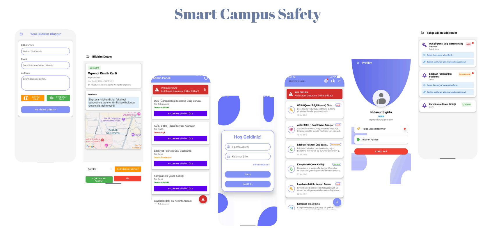

# Smart Campus Health & Safety Incident Reporting Application



This project is an Android-based mobile application that enables rapid reporting, management, and tracking of health, safety, environmental, and technical incidents occurring on campus.

---

## About the Project

The Smart Campus application aims to enhance campus safety by digitizing communication between students/staff and administrative departments. Users can report incidents with photos and location information, while administrators (Admin) can manage these reports through a control panel and broadcast emergency notifications to the entire campus when needed.

---

## Key Features

- **User-Friendly Interface**: Modern, clean and intuitive design (Lavender Theme)
- **Real-Time Report Tracking**: Monitor report status (Open/Under Review/Resolved) in real-time
- **Advanced Filtering**: Filter reports by type (Health, Safety, Environment, etc.) and status
- **Maps & Location Integration**: Select and view incident locations on the map
- **Admin Panel**: Special management, editing, and deletion permissions for administrators
- **Emergency Alert System**: Emergency announcements published by admins appear as red banners on all users' home screens

---

## 👥 Roles and Permissions

### 👤 User

- **Login/Registration**: Secure login with email and password, or create a new account
- **Create Report**: Submit new incidents by adding title, description, type, photo, and location information
- **Browse Reports**: View all reports, search, and filter by various criteria
- **Follow Reports**: Add reports of interest to favorites using the "Follow" button
- **Profile**: View personal information and followed reports on the profile page. Admin updates (status changes, etc.) appear as notifications (Red Dot)

### 🛡️ Administrator (Admin)

- **Management Panel**: View and manage all reports in a single interface
- **Status Updates**: Change report status (Open → Under Review → Resolved)
- **Edit & Delete**: Correct report descriptions or remove inappropriate content
- **Emergency Alerts**: Publish and remove emergency messages visible to all users

---

## Technologies Used

| Technology | Purpose |
|-----------|---------|
| **Kotlin** | Primary programming language |
| **XML** | UI design |
| **Firebase Authentication** | User authentication (Login/Registration/Password Reset) |
| **Firebase Firestore** | NoSQL real-time database (Reports, Users, Announcements) |
| **Google Maps SDK** | Map display and location selection |
| **CameraX / Intent** | Photo capture and processing |
| **Base64 Encoding** | Store captured photos as text (String) in database |
| **ViewBinding** | Safe and efficient access to XML components |
| **RecyclerView** | Dynamic listing and efficient data display |

---

## 📂 Project Structure

```
com.nidanursigirta.smartcampussafety
├── MainActivity.kt
│   └── Login and Navigation (User/Admin control)
├── SignUpActivity.kt
│   └── Registration Screen
├── ForgotPasswordActivity.kt
│   └── Password Reset Screen
├── HomeActivity.kt
│   └── Home Screen (List, Filtering, Search)
├── AddReportActivity.kt
│   └── Create Report (Camera and Location features)
├── DetailActivity.kt
│   └── Report Details (Admin operations)
├── AdminPanelActivity.kt
│   └── Admin Panel (Emergency Alerts and List)
├── ProfileActivity.kt
│   └── Profile, Settings, and Followed Reports
├── MapActivity.kt
│   └── Map Operations (Location Selection/Display)
├── NotificationSettingsActivity.kt
│   └── Notification Preferences
├── FollowedReportsActivity.kt
│   └── Followed Reports List
├── adapters/
│   └── RecyclerView Adapters (Admin, User, Followed)
└── models/
    └── Data Models (Report.kt)
```

---

## Installation & Setup

### 1. Clone the Repository

```bash
git clone https://github.com/YOUR_USERNAME/SmartCampusSafety.git
cd SmartCampusSafety
```

### 2. Open in Android Studio

Open the project in Android Studio and wait for Gradle synchronization to complete.

### 3. Firebase Configuration

- Create your own Firebase project
- Add the `google-services.json` file to the `app/` folder
- Don't forget to add your SHA-1 fingerprint to the Firebase console (required for Maps and Auth)

### 4. Google Maps API Key

Add your Google Maps API key to the meta-data section in AndroidManifest.xml:

```xml
<meta-data
    android:name="com.google.android.geo.API_KEY"
    android:value="YOUR_API_KEY_HERE" />
```

### 5. Run the Application

Launch the project on an emulator or physical device.

---

## Development Team

- **Nidanur Sıgırta** - [GitHub](https://github.com/NidanurSigirta)
- **Betül Bilecen** - [GitHub](https://github.com/BetulBilecen)
- **Duygu Adıgüzel** - [GitHub](https://github.com/Duygusal25)

---

## License

© 2025 Smart Campus Safety. All rights reserved.

---

**For feedback and suggestions:** Visit the [issues](https://github.com/NidanurSigirta/SmartCampusSafety/issues) page.
